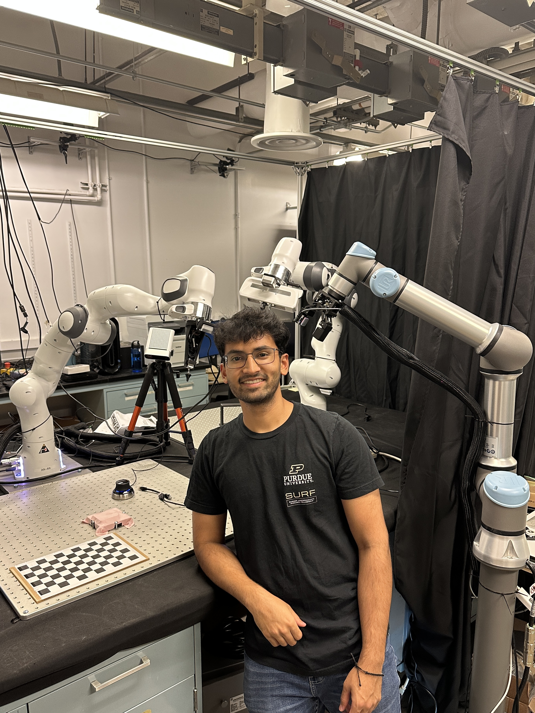

HEADER Raghava Uppuluri's Website

## About me

I am a final-year undergraduate computer engineering student at Purdue researching robotic manipulation at [Purdue MARS](https://www.purduemars.com/) under Yu She. Fascinated by fine motor control in humans, I am interested in:

- leveraging multimodal data (tactile, vision, audio) for end-to-end robotic control
- integrating optimal control with neural networks
- completing contact-rich tasks with tactile feedback

## Timeline

 - June. 2023 - current: More cool robotics research at Purdue MARS. Stay tuned for preprints! :)
 - May. 2023: Led the Purdue Lunabotics team to a 3rd place finish for autonomy (highest award in 12 years of club history!) at [CAT RMC 2023](https://www.alabamaastrobotics.com/caterpillar-rmc-2023.html) ([code](https://github.com/PurdueLunabotics/purdue_lunabotics),[summary](https://github.com/PurdueLunabotics/wiki/wiki/Software#2022-2023))
 - March. 2023: Developed hardware and software for proprioception of a vine robot 

PROJECT raghavauppuluri13/vine-proprio

 - Jan. 2023: Led a robotic leaf following project in collaboration with Purdue ABE lab

PROJECT purdue-mars/leaf_follower

 - Sept. 2022: Interned at Tesla on the Steering team and built a fully-automated hardware-in-the-loop CAN regression tester targeting all vehicles with EPAS
 - June. 2022: Under the [Purdue SURF Fellowship](https://engineering.purdue.edu/Engr/Research/EURO/surf-symposium), developed a vision-based heuristic baseline policy for dual-arm cable grasping and insertion using hybrid force-position control

PROJECT purdue-mars/mars_ros

 - Jan. 2022: Built a rope manipulation policy using Causal InfoGAN and MuJoCo for my CS 593 course project advised by [Prof. Qureshi](https://qureshiahmed.github.io) ([slides](https://docs.google.com/presentation/d/1zRuhXxpXfUB-i6lupotLf98f1N1sZB_0EnAhp_hPZIs/edit?usp=sharing))

PROJECT raghavauppuluri13/rope-manipulation

 - Sept. 2021: Joined [Purdue MARS](https://www.purduemars.com) under Prof. Yu She to work on perception for a robot bandaging project by learning dense visual descriptors for 2D deformable objects (bandage cloth) using contrastive learning ([pdf](https://www.raghavauppuluri.dev/pdfs/fall2021bandaging.pdf), [slides](https://docs.google.com/presentation/d/13pxe3zE_ksI2Qhc5lREsEqtrh3r5qXiZIQ2XcSmoYfM/edit?usp=sharing)) 
 - Jan. 2021: Joined [Purdue CRL](https://www.purdue.edu/crl/) as a research assistant and developed a [goal classifier](https://github.com/raghavauppuluri13/GoalClassifier) for a Learning-from-Demonstration project using RL
 - Dec. 2020: Built a robot arm to stack boxes

PROJECT raghavauppuluri13/box_stacker_arm

## More Information

 - GitHub: [raghavauppuluri13](https://github.com/raghavauppuluri13)
 - Twitter: [raghavaupp](https://twitter.com/raghavaupp)
 - Email: ruppulur (at) purdue.edu
 - LinkedIn: [raghava-uppuluri](https://www.linkedin.com/in/raghava-uppuluri/)
